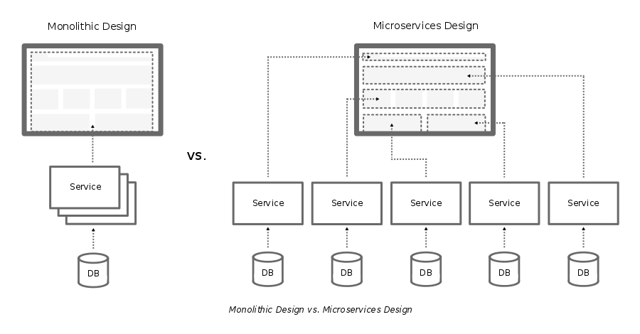
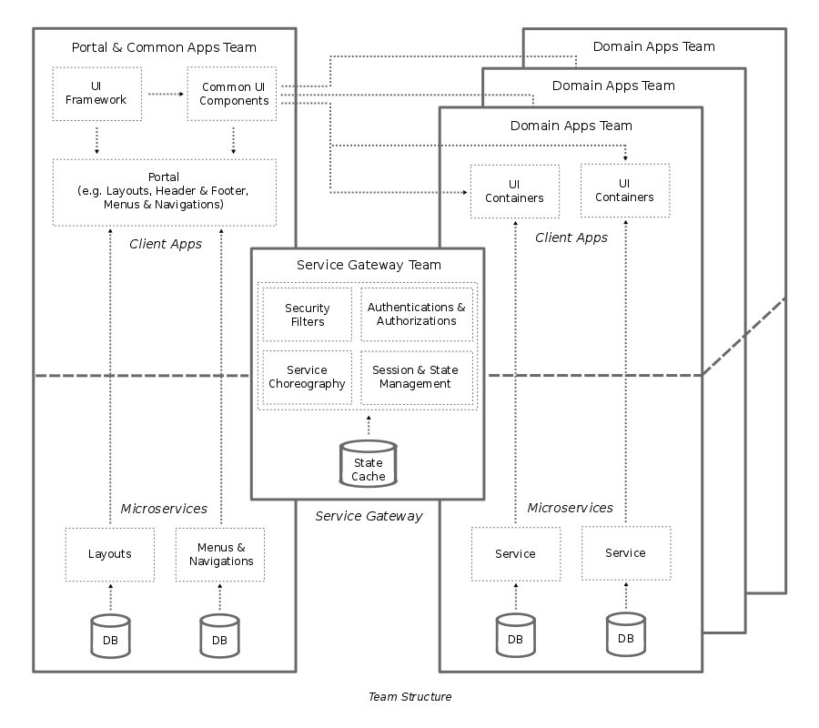

# Design Guide

This is a DRAFT design guide outlining opinions on software development best practices, technology standards, frameworks, and design patterns. It also covers the recommendation for setting up an effective team structure by aligning it based on the defined go-to software design. The focus of this design guide is primarily intended for the development of modern web and mobile application.

This document is meant to be a living document. The software best practices, technology standards, frameworks, and design patterns are continuously changing, and as they do and have been validated, this document will be updated accordingly.

## Software Design

The aims of this software design are to:

+ Define a list of the recommended best practices, technology standards, frameworks, and design patterns to be used as a common development standard for developers.
+ Set a path for adopting and/or migrating to the recommended design guide.
+ Ensure consistency and future extendability of the design.
+ Achieve high maintainability of the code.
+ Achieve high code coverage & compatibility across various of client devices, as well as across client and server.

At the high-level, the design consists of 3 main layers:

+ [Client Apps](#client-apps)
+ [Service Gateway](#service-gateway)
+ [Microservices](#microservices)


The design principles of these layers are:

+ All communications between client and server are done through a centralized [Service Gateway](#service-gateway). This is to make sure security enforcements, session management, and common logics are managed in one common place.
+ [Microservices](#microservices) consists of business and data logics. [Client Apps](#client-apps) should purely handle user interface (UI), user experience (UX), and static contents.
+ [Microservices](#microservices) should be independent and have no awareness of their surrounding. The actions requested to [Microservices](#microservices) are processed through the interactions with its defined unique keys.
+ Maintain as minimal as possible the cross-dependencies between [Client Apps](#client-apps), [Service Gateway](#service-gateway), and [Microservices](#microservices). The structure should allow the setup of multiple small independent teams to manage [Microservices](#microservices) and [Client Apps](#client-apps), and on the same time to ensure a single control of security and common logic in a centralized small [Service Gateway](#service-gateway) team.

The interactions between [Client Apps](#client-app) to [Microservices](#microservices) will need to be as much as possible done at the level of each service. This is to reduce cross-dependencies between [Client Apps](#client-app) and [Microservices](#microservices). This is needed to reduce cross-dependencies and to avoid it to become monolithic. The diagram below shows the comparison between application with monolithic design vs. microservices design.



Although it may be possible to migrate an application that was built on monolithic design to microservices design by refactoring the existing code, however this approach is complex and the results may highly possible will not achieve the intended design of microservices. To achieve a clean microservices solution, it is recommended to consider code rewrite.

### Client Apps

*Client Apps* consists of user interface (UI) and experience (UX) logics, these are executed at the client devices or browsers. To achieve highest code coverage, faster time to market, and cost efficiency, the 'Responsive Web Design' and 'Single Page Design' will be an ideal technology solution. There are cases (especially for developing games application with intensive graphics processing), native app development is recommended.

To achieve high performance web application and mobile hybrid app solution, there are some best practices to be followed (refer to [Performance Best Practices](#performance-best-practices)).

#### User Interface (UI) Component

The characteristics of UI component are:

+ Follow the 'Atomic Design' principles (refer to [Atomic Design](http://atomicdesign.bradfrost.com)).
+ Behave as 'Dump Component', it has no awareness of the surrounding. It interacts through its defined request props.
+ Should be small and has a specific specialized UI purpose.

#### User Interface (UI) Container

+ Act as 'Smart Component', it provides the information to UI component and stitches interactions between multiple UI components.
+ Facilitate data request to and response from server through rest API calls.

#### User Interface (UI) State

With the application UI logics are managed at the client device or browser, the requirements to manage application state has increasingly become more complicated. The state can include server responses and cached data, as well as locally created data that has not yet persisted to the server.

### Service Gateway

The responsibilities of Service Gateway are:

+ Authentication
+ Authorization
+ Session management
+ Security enforcement

#### Authentication


#### Authorization


### Microservices

The characteristics of *Microservices* are:

+ A small lightweight software of a specialized business logic implementation.
+ Loosely coupled, it can be independently developed, deployed, and scaled.
+ Communicate over network via 'technology agnostic' protocols.
+ Stateless

Make use of 'Domain-Driven Design', which consists of below building blocks:

+ *Entity* is an object with an individual identity, e.g. Persons, Tasks.
+ *Value Objects* do not have their own identity, e.g. Gender, it makes sense only in the context of a specific 'Person' and therefore does not have an independent identity.
+ *Aggregates* are composite domain objects. They facilitate the handling of invariants and other conditions.
+ *Services* contains business logic.
+ *Repositories* serve to access all entities. Typically, there is persistent database behind repository.
+ *Factories* are mostly useful to generate complex domain objects.

## Performance Best Practices

In order to develop a high performance web application and hybrid mobile app, there are some best practices to follow.

+ Choose JavaScript and CSS framework which have been optimized and tested to work well across devices. For e.g. [Bootstrap](http://getbootstrap.com/) is a popular CSS framework for developing responsive web design.
+ Optimize all UI artifacts, e.g. reduce image size. Reduce image quality to the optimum quality as needed to display to the users.
+ Use image sprite to reduce client requests to the server.
+ Use compression, e.g. image compression, page compression.
+ Implement adaptive JavaScript logic to decide a specific image size to send to small size devices.
+ Use CSS or SVG for icons, logos, buttons, or adjustable size images.
+ Make sure all client logics and contents are cacheable on CDN (Content Delivery Network). Set appropriate cache settings and expiration time.
+ Remove unused JS and CSS components. Avoid from blindly using common superset framework. Common framework tends to be packaged with all supported components which all of them may not be used in your application.
+ Use 'rem' instead of 'px' to reduce hardcode logic and redundant code in CSS.
+ Adopt 'Client MVC' design, do not generate the UI on the server.
+ Use 'Single Page Application' design.
+ HTML DOM processing is slow, adopt 'Virtual DOM' approach.
+ Clean segregation between UI / UX, Content, and Data logic.
+ Implement 'Event Driven Design'. A request to and response from server should be specific to the event triggered from the client, for e.g.: Pagination logic, clicking on the next page should be responded only with data as the output. Changing language preference should be responded only with contents specific to the active page.
+ On mobile app, UI / UX artifacts should be wrapped on the app. Use wrapper framework like Cordova / PhoneGap.
+ Use 'Crosswalk - crosswalk-project.org' with Cordova to improve performance for hybrid mobile app.
+ Avoid network access as much as possible. Do not call server for landing / first page. When it is needed, it should be a non-blocking call.
+ Do not wait for the data to display the UI.
+ Minify everything including HTML and JSON contents.
+ Minimize number of redirects, number of server client roundtrips.
+ Reduce as much as possible requests to server, combine JS artifacts into limited files. JS should be called at the bottom of the page.
+ Clean up developer comments and console.log.
+ Optimize server side logging. On production environment, only FATAL and ERROR logging should be enabled.
+ Use performance speed test to identify bottlenecks, for e.g. 'Google PageSpeed'.

## Team Structure

The guidelines for setting up team structure are:

+ It must be organized by following the application design.
+ The ideal size of a team should be between two to maximum nine people.
+ Each team must be independent from each other. Interactions between teams are done through their established design contracts.
+ No duplication of ownership and responsibility between teams. Each team should own unique defined capabilities.
+ Cross-functional team of individuals who have the ability, knowledge and skills to manage end-to-end their appointed scope.
+ Organize team alignment based on products, avoid from defining it based on projects.

Below diagram illustrates the high-level team structure with its cross dependencies.



## Application Code Structure

Application is structured based on the code execution either at the client, server or both. E.g.

```
scheduler/
├── client/
|   └── actions/
|   ├── components/
|   ├── containers/
|   └── routes
├── shared/
└── server/
    ├── entities/
    |   ├── persons
    |   └── tasks
    ├── services/
    └── repositories/
```
