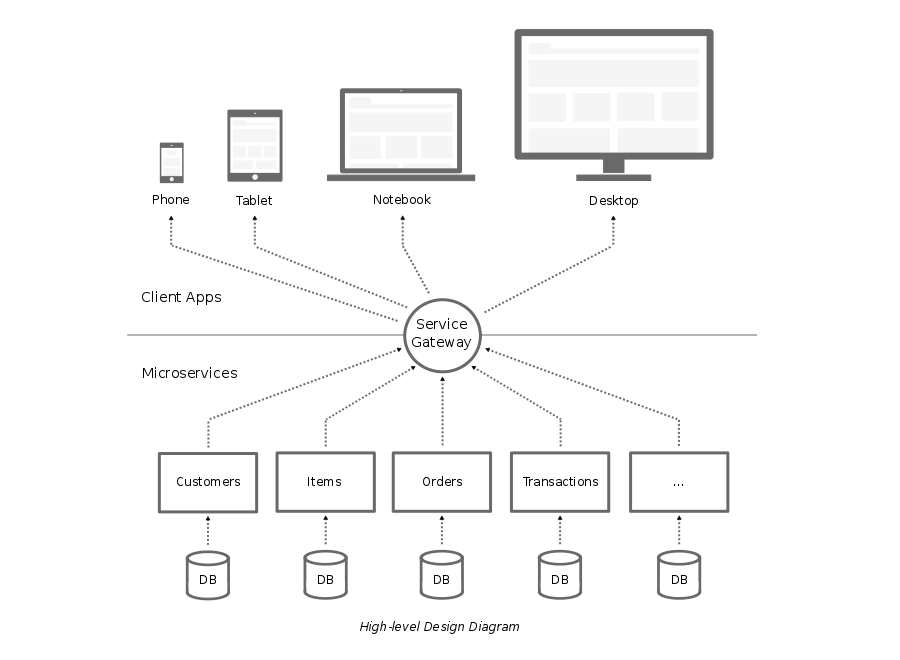

# Design Guide

This is a DRAFT design guide outlining opinions on software development best practices, technology standards, frameworks, and design patterns. It also covers the recommendation for setting up an effective team structure based on the defined go-to software design. The focus of this design guide is primarily intended for the development of modern web and mobile application.

This document is meant to be a living document. The software best practices, technology standards, frameworks, and design patterns are continuously changing, and as they do and have been validated, this document will be updated accordingly.

## Software Design

The aims of the software design are to:

+ Define a list of the recommended best practices, frameworks, and design patterns to be used as the development standards.
+ Set a path for adopting and/or migrating to the recommended technologies, frameworks and design patterns.
+ Ensure consistency and future extendability of the design.
+ Achieve high maintainability of the code.
+ Achieve high coverage & compatibility across various of client devices.

At the high-level, the design consists of 3 main layers:

+ Client Apps
+ Service Gateway
+ Microservices

The principles of these layers are:

+ All communications between client and server are done through a centralized [Service Gateway](#service-gateway). This is to make sure security enforcements, session management, and common logics are managed in one common place.
+ [Microservices](#microservices) consists of business and data logics. [Client Apps](client-apps) should purely handle user interface (UI), user experience (UX), and static contents.
+ [Microservices](microservices) should be independent and have no awareness of their surrounding. The actions requested to [Microservices](microservices) are processed through the interactions with its defined unique keys.
+ Reduce cross-dependencies between [Client Apps](client-apps), [Service Gateway](service-gateway), and [Microservices](microservices). The structure should allow the setup of multiple small independent agile teams to manage [Microservices](microservices) and [Client Apps](client-apps), and on the same time to ensure a single control of security and common logic in a centralized small [Service Gateway](service-gateway) team.

### Microservices

The characteristics of *Microservices* are:

+ A small lightweight software of a specialized business logic implementation
+ Loosely coupled, it can be independently developed, deployed, and scaled
+ Communicate over network via 'technology agnostic' protocols
+ Stateless

Make use of 'Domain-Driven Design', which consists of below building blocks:

+ *Entity* is an object with an individual identity, e.g. Customers, Items.
+ *Value Objects* do not have their own identity, e.g. Address, it makes sense only in the context of a specific customer and therefore does not have an independent identity.
+ *Aggregates* are composite domain objects. They facilitate the handling of invariants and other conditions. An order, for instance, can be an aggregate of order lines. This can be used to ensure that an order from a new customer doesn't exceed a certain value. This is a condition that has to be fulfilled by calculating values from the order lines so that the order as *Aggregate* can control these conditions.
+ *Services* contains business logic.
+ *Repositories* serve to access all entities. Typically, there is persistent database behind repository.
+ *Factories* are mostly useful to generate complext domain objects.

### Service Gateway

The responsibilities of Service Gateway are:

+ Authentication
+ Authorization
+ Session management
+ Security enforcement

#### Authentication

#### Authorization

### Client Apps

Client Apps consists of user interface (UI) and experience (UX) logic, these are executed at the client devices or browsers. We recommends to use 'Responsive Web Design' primarily because we believe web technology will continue to advance further at faster pace, and the trend on Internet will influence technology investments to evolve mostly around web technology. The speed and performance of browser engines will continue to improve, and devices as well as the Internet connection speed will greatly increased as well. There are some best practices for developing high performance web application, refer to [Performance Best Practices](#performance-best-practices)

The interactions between client apps to microservices will need to be done at the micro level. This is to reduce cross-dependencies between client apps and microservices. The diagram below shows the comparison between monolithic design vs. microservices design.

#### UI Components

#### UI Containers

#### UI State

With the UI logics are managed at the client device or browser, the requirements to manage application state has increasingly become more complicated. This state can include server responses and cached data, as well as locally created data that has not yet persisted to the server.

## Performance Best Practices

In order to develop a high performance web application, there are some best practices to follow.

+ Choose JavaScript and CSS framework which have been optimized and tested to work well across devices. For e.g. [Bootstrap](http://getbootstrap.com/) is a popular CSS framework for developing responsive web design.
+ Optimize all UI artifacts, e.g. reduce image size. Reduce image quality to the optimum quality as needed to display to the users.
+ Use image sprite to reduce client requests to the server.
+ Use compression, e.g. image compression, page compression.
+ Implement adaptive JavaScript logic to decide a specific image size to send to small size devices.
+ Use CSS or SVG for icons, logos, buttons, or adjustable size images.
+ Make sure all client logics and contents are cacheable on CDN (Content Delivery Network). Set appropriate cache settings and expiration time.
+ Remove unused JS and CSS components. Avoid from blindly using common superset framework. Common framework tends to be packaged with all supported components which all of them may not be used in your application.
+ Use 'rem' instead of 'px' to reduce hardcode logic and redundant code in CSS.
+ Adopt 'Client MVC' design, do not use server side to process UI / UX logic.
+ Use 'Single Page Application' design.
+ HTML DOM processing is slow, adopt 'Virtual DOM' approach.
+ Clean segregation between UI / UX, Content, and Data logic.
+ Implement 'Event Driven Design'. A request to and response from server should be specific to the event triggered from the client, for e.g.: Pagination logic, clicking on the next page should be responded only with data as the output. Changing language preference should be responded only with contents specific to the active page.
+ On mobile app, UI / UX artifacts should be wrapped on the app. Use wrapper framework like Cordova / PhoneGap.
+ Use 'Crosswalk - crosswalk-project.org' with Cordova to improve performance for hybrid mobile app.
+ Avoid network access as much as possible. Do not call server for landing / first page. When it is needed, it should be a non-blocking call.
+ Do not wait for the data to display the UI.
+ Minify everything including HTML and JSON contents.
+ Minimize number of redirects, number of server client roundtrips.
+ Reduce as much as possible requests to server, combine JS artifacts into limited files. JS should be called at the bottom of the page.
+ Clean up developer comments and console.log.
+ Optimize server side logging. On production environment, only FATAL and ERROR logging should be enabled.
+ Use performance speed test to identify bottlenecks, for e.g. 'Google PageSpeed'.

## Team Structure
